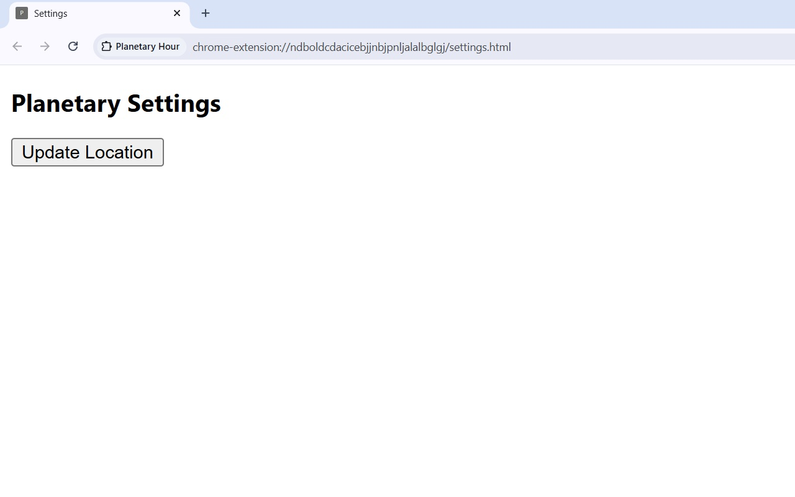
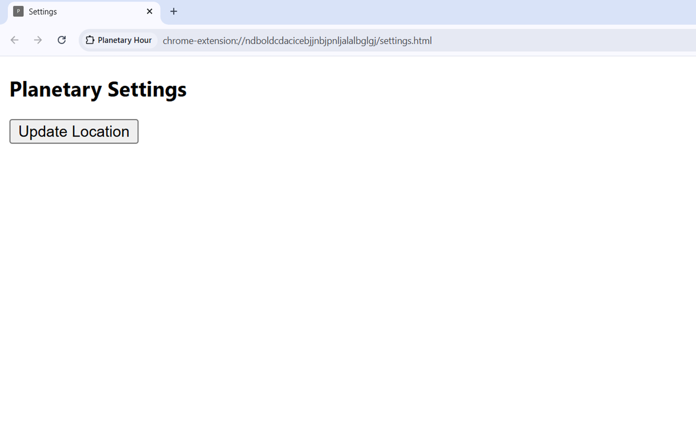

# Planetary Hour

Planetary Hour is a Chrome extension that displays the current planetary hour as a live toolbar icon using location-aware sunrise and sunset calculations.

## Features

- Real sunrise/sunset timing
- Geolocation integration
- Dynamic toolbar icon updates
- Automated background scheduling
- Persistent state management
- Payment and authentication support

## Tech Stack

- JavaScript
- Chrome Extensions (Manifest V3)
- Chrome APIs
- Geolocation API
- Sunrise/Sunset API integration
- ExtensionPay
- Stripe

## Engineering Challenges Solved

- Service-worker lifecycle limitations
- Background update reliability
- Sequencing and time-boundary logic
- State consistency across browser restarts

## Screenshots

## Planned Features

- Countdown until next planetary change
- Current planetary-hour window display
- Full daily planetary schedule
